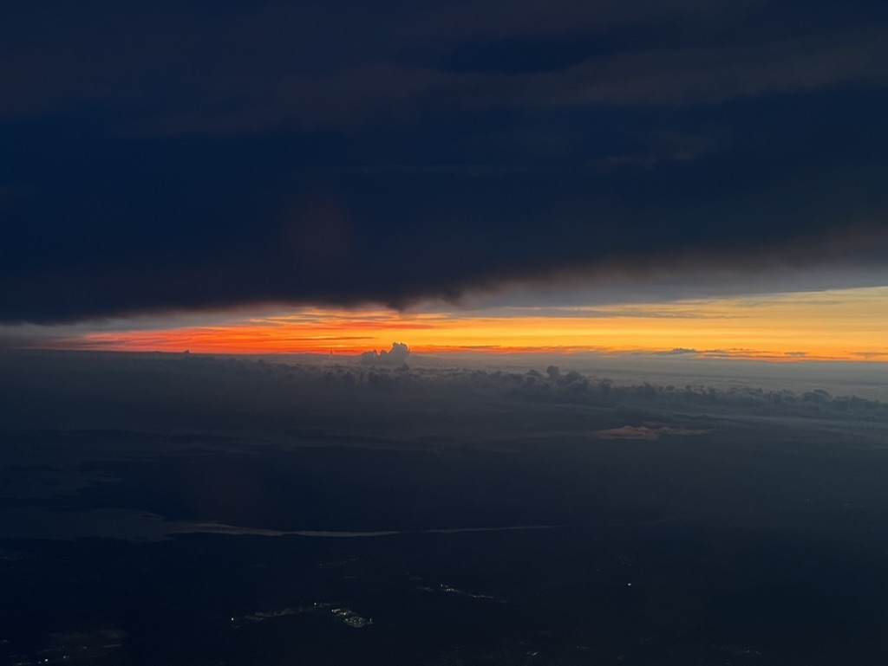
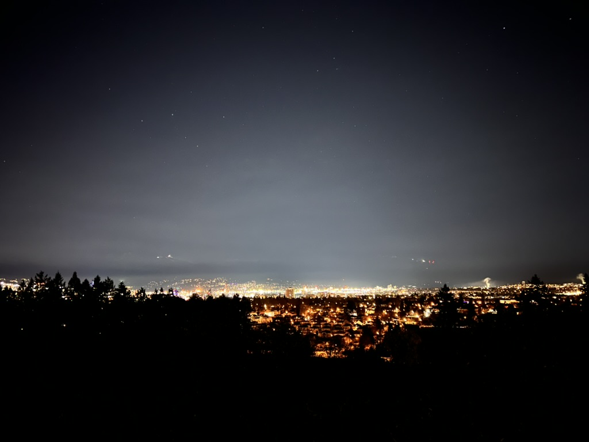

## Academic Path
{align="left": style="height:350;width:250px"}
Growing up in Taipei city, Taiwan, I found myself moving to the west coast of Canada at the age of 12 where I finished high school as well as my undergraduate. Initially with the goal of playing hockey, my time in Canada has been a roller coaster ride in both personal and academic path. My undergraduate journey was no different and I eventually found my passion in physics and astronomy. At the University of British Columbia ([UBC](https://www.ubc.ca)), I spent my first two years as a nutrition major before being accpeted in the combined honours program of physics and astronomy, and subsequently graduated with a bachelor degree in science in May 2024.

Currently, I am a Master's student working with [Dr. Tracy Webb](https://www.physics.mcgill.ca/~webb/) at the Trottier Space Institute ([TSI](https://tsi.mcgill.ca)) at McGill University with a research focus on [Extragalactic Astronomy](https://en.wikipedia.org/wiki/Extragalactic_astronomy). More specfically, I am studying a group of Brightest Cluster Galaxies ([BCGs](https://en.wikipedia.org/wiki/Brightest_cluster_galaxy)) at redshift between 0.7 - 1.2, then interpreting their properties through different astrostatistics techniques and coming up with explanation of how they fit into the bigger picture that is galaxy evolution and their environmental impact with other previous studied BCGs.

## Previous Experiences
{align="right": style="height:350;width:250px"}

The last two years of undergraduate and research experience blueprinted out my area of research interests for the current Master's project. I truly believe that these experiences have helped me down the academic path and shaped my mindset towards scientific research. A more detailed information for each experiences can be found in the [Research](../reasearch/index.md) page.

I attended a summer student program in 2022 with National Centre for Theoretical Science ([NCTS](https://nctstca.github.io/events/202207-tcassp/)) in Taipei, Taiwan with [Dr. Ellis R Owen](https://www.ellisowen.org/bio) where we tackled the impact of cosmic rays on circumgalactic gas dynamics. In the following school year, I completed my honour thesis at UBC with Dr. Jess McIver alongside the [Gravitiational Wave astrophysics](https://gravitational-waves.phas.ubc.ca) group which I worked on an extension for a machine learning algorithm called [GSpyNetTree](https://arxiv.org/abs/2304.09977) for categorizing overlapping [Compact Binary Coalescence Signals](http://www.scholarpedia.org/article/Gravitational_Waves:_Science_with_Compact_Binary_Coalescences). 

The summer of 2023 took me to Gothenburg,Sweden for a fellowship with Chalmers Astrophysics & Space Sciences Summer ([CASSUM](http://cosmicorigins.space/cassum-vico23)) program. I was working with [Dr. Jonanthan C. Tan](https://research.chalmers.se/en/person/tanj) and [Dr. Maya A. Petkova](https://mayapetkova32.wordpress.com) where we did a case study on "[The Brick](https://www.mpg.de/18032309/a-bubble-in-the-brick)" in the [Centre Molecular Zone](https://en.wikipedia.org/wiki/Central_Molecular_Zone) of Milky Way and explored the kinematic properties of identified structures using dendrograms. 

In my final school year, I was working with [Dr. Allison Man](https://phas.ubc.ca/users/allison-man) where we explored the properties of [Quiescent Galaxies](https://en.wikipedia.org/wiki/Quenching_(astronomy)) at redshift ~ 2. More specifically, we wanted to understand the overall dust and molecular gas mass of these massive galaxies, and compared the results with their spectral profile data. Our goal was to come up with an explanation on their quenching mechanisms as it has been an interesting topic within the extragalactic astronomy for the past decades.

## Other Interests and Activities

Since joining the McGill community, I have been involved with outreach activities such as public talks. Public talks are event where expert of the field can give a presentation or have a panel where public can come in to listen and ask questions about astrophysics subjects. I have been consistently volunteered for the this event, and planning to be involved in more outreach activities in the future.

Outside of astrophysics, I enjoy travelling to different places around the world. (A link will be here for the photos and such, placeholder for now)

## CV

<!-- How to embed a PDF -->
<iframe width="100%" height="600" src="./media/Curriculum Vitae - Fall 2024.pdf">