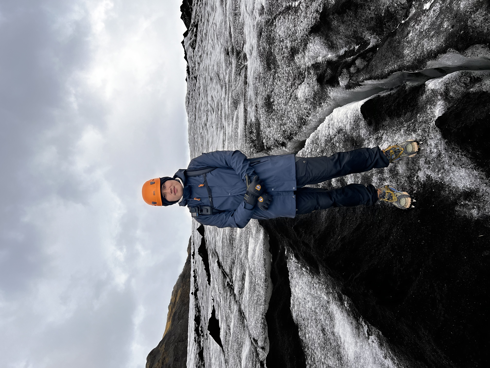

## Welcome 歡迎 

{align="right": style="height:200;width:200px"}
Hello Everyone! My name is Sheng-Lung Hsueh, also go by Steven Hsueh on the daily basis. I am currently a graduate student at McGill University in the Department of Physics and affiliated with Trottier Space Institute ([TSI](https://tsi.mcgill.ca)). I previously studied at the University of Biritsh Columbia and graduated with a Bacholar's degree in Combined Honours in Physics and Astronomy.

My research interests focus on extragalactic astronomy, and more specifically on the evolution of galaxies as well as their properties during different epochs of the Universe.

If you're like to learn more about me and what I am working on, you can find an introduction to [my research](./reasearch/index.md), some info on some [recent projects](./projects/index.md) and some more info [about me](./about/index.md).

## Bio & Contacts

**Email**

sheng-lung.hsueh@mail.mcgill.ca 

**Office** 

Trottier Space Insitute at McGill / Insitut spatial Trottier de McGill

Department of Physics, McGill University

060 - 3550 University Street, Montreal, QC H3A 2A7